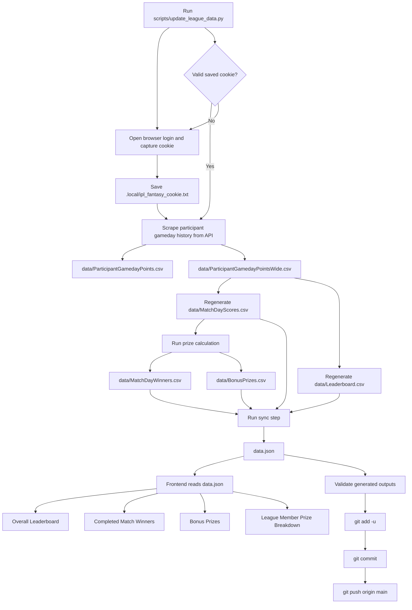

# Match Update Pipeline

This document shows the end-to-end pipeline for turning an authenticated IPL fantasy refresh into synced site data.

## Notes

- `scripts/update_league_data.py` is the intended operator entry point.
- The updater can reuse `.local/ipl_fantasy_cookie.txt` or refresh it via a browser-assisted login flow.
- `scripts/scrape_participant_gameday_points.py` refreshes the long and wide participant gameday CSVs from the IPL fantasy API.
- `scripts/sync_csvs_to_data_json.py` rebuilds `data/MatchDayScores.csv` and `data/Leaderboard.csv`, then regenerates `data.json`.
- `scripts/calculate_prizes.py` derives `data/MatchDayWinners.csv` and `data/BonusPrizes.csv`.
- `data.json` should not be hand-edited; it should always be regenerated from the CSV sources.